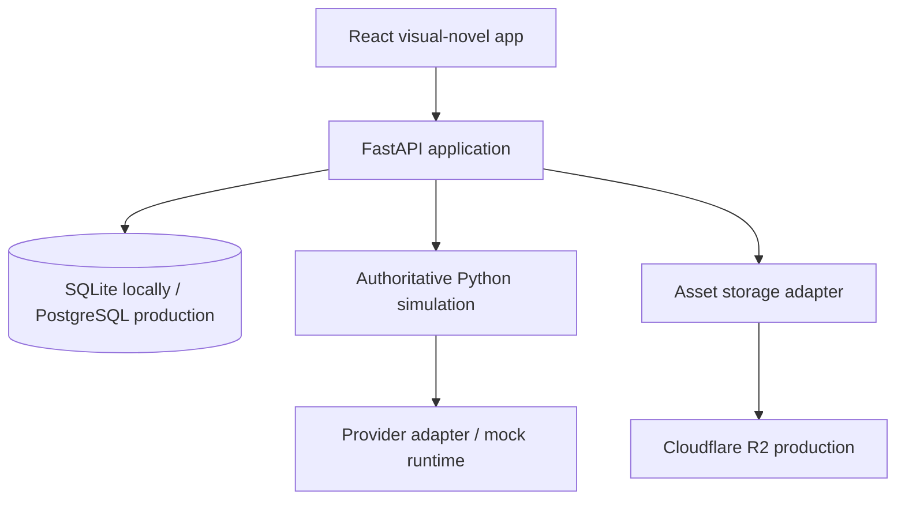

# Architecture

## Boundary decisions

- REST supports durable creator, lobby, manifest, run and admin state. WebSocket distributes lobby and run notifications; it does not make the browser authoritative.
- SQLAlchemy models target portable SQL. SQLite enables local tests; PostgreSQL is the production database.
- Asset operations use an `AssetStorage` interface. `LocalAssetStorage` is only for development; `R2AssetStorage` owns signed upload/download in deployment.
- Runtime providers receive a structured decision request and return an intention object. Secret resolution is server-only.

